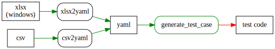

# How to write complex test case by DIY test case generator.

## What is this?
We have to write a lot of code and test at this moment.  
Also we should maintain such a huge and complex code and test that follow changes bussiness situations so fast.  
It's too hard to write and keep quality test code such a complex bussiness logic.  

**We are a coder**. Let's fix the issues with generator for make the tests easily and fastly.

You larn this way that you can easy to scale these situations.

## TL;DR



### for Windows user
* Clone from github https://github.com/panghea/testcasegenerator
* `yarn`
* `yarn watch_xlsx`
* Define your complex bussiness patterns in xlsx.
* Modify generate_test_case.rb what you need.
* Copy generated test code to your project.
* Run and modify data that you want.

### for Not Windows user
* Clone from github https://github.com/panghea/testcasegenerator
* `yarn`
* `yarn watch_csv`
* Define your complex bussiness patterns in csv.
* Modify generate_test_case.rb what you need.
* Copy generated test code to your project.
* Run and modify data that you want.


## Prepare to use 

### Clone from github
open your terminal or command prompt.
```
git clone https://github.com/panghea/testcasegenerator
```


### Example

This exapmle is workflow for Item Packaging.
Item Package defined by Item Category and Item Ship Type.
There are 5 route to approve to item shipping for The Package.


#### Code Example
```
public class Routes {
    // result for Package Type
    public String packageType;

    public void approveA(Item item) {
        // approve with Item Category and Ship Type

        // process data and write to the database....
        // if the final approve flow record package type to this.packageType 
    }
    public void approveB(Item item) {
        // approve with Item Category and Ship Type

        // process data and write to the database....
        // if the final approve flow record package type to this.packageType 
    }
    public void approveC(Item item) {
        // approve with Item Category and Ship Type

        // process data and write to the database....
        // if the final approve flow record package type to this.packageType 
    }
    public void approveD(Item item) {
        // approve with Item Category and Ship Type

        // process data and write to the database....
        // if the final approve flow record package type to this.packageType 
    }
    public void approveE(Item item) {
        // approve with Item Category and Ship Type

        // process data and write to the database....
        // if the final approve flow record package type to this.packageType 
    }
    public String Reject(Item item) {
        // reject workflow when somthing happend at bussiness working.

        // clean up data and record where to reject approve process to the database
        return approveProcessName;
    }
}
```

#### Here is Excel data expamle(input/data_pattern.xlsx)

|**Item Category Code**|**Item Ship Type**|Approve Route A|Approve Route B|Approve Route C|Approve Route D|Approve Route E|**Package Type**|
|---|---|---|---|---|---|---|---|
|Category A|Ship Type B|skip|**need**|skip|skip|**need**|Package C1|
|Category A|Ship Type C|**need**|**need**|skip|**need**|**need**|Package C2|
|Category A|Ship Type D|**need**|**need**|**need**|**need**|**need**|Package A2|
|Category A|Ship Type C|skip|skip|skip|skip|**need**|Package A3|
|Category B|Ship Type A|**need**|**need**|skip|**need**|**need**|Package C1|
|Category B|Ship Type B|skip|**need**|**need**|**need**|**need**|Package A2|
|Category B|Ship Type F|**need**|**need**|skip|**need**|**need**|Package B7|
|Category C|Ship Type B|**need**|**need**|**need**|**need**|**need**|Package B4|
|Category C|Ship Type A|**need**|**need**|skip|skip|**need**|Package A3|
|Category D|Ship Type F|skip|**need**|skip|**need**|skip|Package C2|
|Category D|Ship Type G|skip|**need**|skip|skip|**need**|Package D1|
|Category E|Ship Type A|**need**|skip|skip|skip|skip|Package F2|

#### Here is Csv data expamle(input/data_pattern_csv.yaml)
It write csv to inside yaml that usefull to read and edit for human and for converter.

```
data_csv: 
  - ["Category A","Ship Type B","skip","need","skip","skip","need","Package C1"]
  - ["Category A","Ship Type C","need","need","skip","need","need","Package C2"]
  - ["Category A","Ship Type D","need","need","need","need","need","Package A2"]
  - ["Category A","Ship Type C","skip","skip","skip","skip","need","Package A3"]
  - ["Category B","Ship Type A","need","need","skip","need","need","Package C1"]
  - ["Category B","Ship Type B","skip","need","need","need","need","Package A2"]
  - ["Category B","Ship Type F","need","need","skip","need","need","Package B7"]
  - ["Category C","Ship Type B","need","need","need","need","need","Package B4"]
  - ["Category C","Ship Type A","need","need","skip","skip","need","Package A3"]
  - ["Category D","Ship Type F","skip","need","skip","need","skip","Package C2"]
  - ["Category D","Ship Type G","skip","need","skip","skip","need","Package D1"]
  - ["Category E","Ship Type A","need","skip","skip","skip","skip","Package F2"]
```

## Generate Yaml from each data file (Excel or CSV)

### Generate Yaml from xlsx file.(Windows only)
If you using windows you can generate from xlsx to yaml. 
```
cd testcasegenerator
ruby xlsx2yaml.rb
```
### Generate Yaml from CSV file.
If you don't using windows that you can generate from csv to yaml. 
```
cd testcasegenerator
ruby csv2yaml.rb
```

### Output yaml file
generated/generator_input.yaml
```
---
- ItemCategory: Category A
  ItemShipType: Ship Type B
  ApproveRouteA: skip
  ApproveRouteB: need
  ApproveRouteC: skip
  ApproveRouteD: skip
  ApproveRouteE: need
  PackageType: Package C1
- ItemCategory: Category A
  ItemShipType: Ship Type C
  ApproveRouteA: need
  ApproveRouteB: need
  ApproveRouteC: skip
  ApproveRouteD: need
  ApproveRouteE: need
  PackageType: Package C2
...
```

## Generate Test Case File from Yaml file
```
ruby generate_test_case.rb
```

### Generator Source
It just few code to generate test cases.

```
def generateTestCase(testCase) 
    outputCodes = []
    # write method header
    outputCodes.push(<<-GENERATOR.gsub(/^$/,"")
        /*
        * <b>Test Case Of [#{testCase["ItemCategory"]}] and [#{testCase["ItemShipType"]}]</b><br>
        * <pre>
        * ======================================================
        * 2017/09/15 Tadayuki Tanigawa
        * </pre>
        * @throws Throwable
        */
        @Test
        public void testCase#{"%02d" % (testCase['caseNo']+ 1)}_#{testCase['ItemCategory'].gsub(/ /,"_")}_#{testCase['ItemShipType'].gsub(/[- ]/,"_")}() throws Throwable {
            // prepare for test data by route
                    GENERATOR
                    );

    # prepare data for each route
    outputCodes.push(prepareTestData(testCase).join())

    # do test methods
    outputCodes.push(<<-GENERATOR

            // create item
            Item item = new Item();
            item.setCategory("#{testCase["ItemCategory"].gsub(/.* /,"")}");
            item.setShipType("#{testCase["ItemShipType"].gsub(/.* /,"")}");

            // call each route 
            Routes routes = new Routes();
            GENERATOR
    )
    outputCodes.push(testRouteCall(testCase).join())

    # assert test result
    outputCodes.push(<<-GENERATOR

            // assert package type
            assertThat("Package Type", routes.packageType, is("#{testCase["PackageType"].gsub(/.* /,"")}"));
            GENERATOR
    )
    outputCodes.push(<<~GENERATOR
            #{testCase["Assertions"]}
            GENERATOR
    )

    outputCodes.push(<<-GENERATOR
        }
            GENERATOR
            )

    outputCodes
end
```

### Generated code 
This is genereted test method by generate_test_case.rb  

If you have to add route with your bussiness rolue. It easy tests by generator.  
You just add a new item route as a row into xlsx or csv.  

```
        /*
        * <b>Test Case Of [Category B] and [Ship Type F]</b><br>
        * <pre>
        * ======================================================
        * 2017/09/15 Tadayuki Tanigawa
        * </pre>
        * @throws Throwable
        */
        @Test
        public void testCase07_Category_B_Ship_Type_F() throws Throwable {
            // prepare for test data by route
            // For Route A insert or update data to the Database 
            dao.update("Update ItemRouteTable ... RouteName = 'ApproveRouteA' ,itemCategory = 'Category B'....");
            // For Route B insert or update data to the Database 
            dao.insert("Insert RouteTable ... SELECT 'B' AS RouteType ,'Category B' as ItemCategory....");
            dao.update("Update ItemCategoryTable ... itemCategory = 'Category B Where itemShipType = 'Ship Type F'")
            dao.update("Update ItemRouteTable ... RouteName = 'ApproveRouteB' ,itemCategory = 'Category B'....");
            // For Route D insert or update data to the Database 
            dao.insert("Insert RouteTable ... SELECT 'D' AS RouteType ,'Category B' as ItemCategory....");
            dao.update("Update ItemRouteTable ... RouteName = 'ApproveRouteD' ,itemCategory = 'Category B'....");
            // For Route E insert or update data to the Database 
            dao.insert("Insert RouteTable ... SELECT 'E' AS RouteType ,'Category B' as ItemCategory....");
            dao.update("Update ItemRouteTable ... RouteName = 'ApproveRouteE' ,itemCategory = 'Category B'....");

            // create item
            Item item = new Item();
            item.setCategory("B");
            item.setShipType("F");

            // call each route 
            Routes routes = new Routes();
            // approve by A
            route.approveA(item);
            // approve by B
            route.approveB(item);
            // approve by D
            route.approveD(item);
            // approve by E
            route.approveE(item);

            // assert package type
            assertThat("Package Type", routes.packageType, is("B7"));
        }
```

## Automatically code generation when you save xlsx or csv.
It watches file modification and execute ruby automatically.  
You just edit generate_test_case.rb or data_pattern.xlsx or data_pattern_csv.yaml!

For windows
```
yarn watch_xlsx
```
For Otheres
```
yarn watch_csv
```


## Next
* You can add custom expression that treat data or assertion of test code into Yaml for really complex tests.
    ```
    - ItemCategory: Category A
      ItemShipType: Ship Type B
      ....
      Assertions: |1-
                   // assert Asset Type of Category A
                   assertThat("Asset Type", item.getAssetType(), is("23"));
    ```
    change generate_test_case.rb
    ```
    outputCodes.push(<<~GENERATOR
            #{testCase["Assertions"]}
            GENERATOR
    )
    ```
    then generated code
    ```
            // assert Asset Type of Category A
            assertThat("Asset Type", item.getAssetType(), is("23"));
    ```
    ** You can define yaml rule and generated result easily. **


* You can write excel document from yaml that like this way! It's really usefull!  
If you have interest that CALL ME!


## FAQ
1. Why use yaml for generation?  
   * Yaml is easy to modify than csv and xlsx in text editor.
   * Yaml is a text file, that easy to manage on Git.
   * If xlsx or csv is broken, We can re-generate from yaml to each files, you just make a generator to xlsx or csv.
   * Yaml read faster then xlsx from Ruby. We sometime dual with big size xlsx files.
 
2. Why use Ruby?
   * Ruby's here document is awesome to code generation.
   * Ruby is good for excel automation so far.
